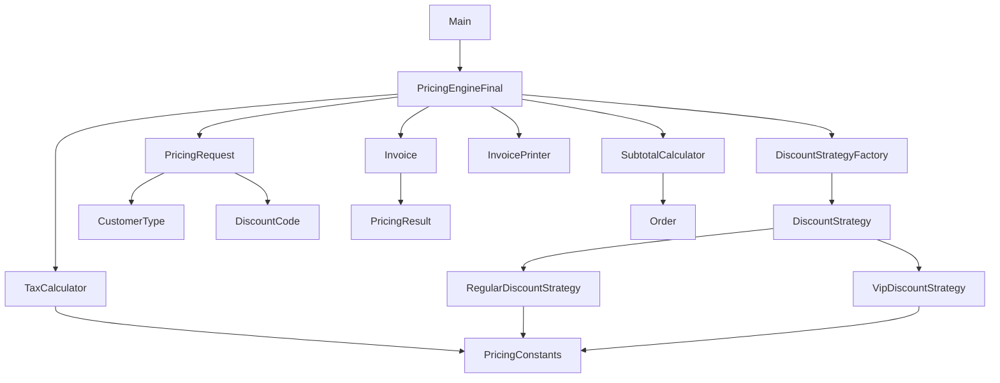

# Comprehensive Project Structure Guide

## Directory Structure Overview

This document provides a detailed explanation of the project structure and the purpose of each component in the refactored pricing engine.

## Complete Directory Tree

```
windsurf-project/
├── build.gradle                           # Gradle build configuration
├── settings.gradle                         # Gradle project settings
├── .gitignore                              # Git ignore patterns
├── README.md                               # Main project documentation
├── docs/                                   # Documentation directory
│   ├── REFACTORING_GUIDE.md               # Detailed refactoring process
│   ├── COMMIT_SUMMARY.md                   # Commit analysis and learning
│   ├── PROJECT_STRUCTURE.md               # This file
│   └── START_HERE.md                      # Quick reference guide
├── integration_tests/                      # Python integration tests
│   ├── requirements.txt                    # Python dependencies
│   └── test_pricing_integration.py         # Integration test suite
├── Dockerfile                              # Multi-stage Docker configuration
├── docker-compose.yml                      # Docker development environment
└── src/
    ├── main/
    │   └── java/
    │       └── com/
    │           └── pricing/
    │               ├── Main.java            # Application entry point
    │               ├── PricingEngine.java   # Original poorly-designed code
    │               ├── PricingEngineFinal.java # Final refactored version
    │               ├── constants/           # Configuration constants
    │               │   └── PricingConstants.java
    │               ├── factory/             # Factory pattern implementations
    │               │   └── DiscountStrategyFactory.java
    │               ├── model/               # Domain models and data classes
    │               │   ├── CustomerType.java
    │               │   ├── DiscountCode.java
    │               │   ├── Invoice.java
    │               │   ├── Order.java
    │               │   ├── PricingRequest.java
    │               │   └── PricingResult.java
    │               ├── printer/             # Presentation layer
    │               │   └── InvoicePrinter.java
    │               ├── service/             # Business logic services
    │               │   ├── DiscountCalculator.java
    │               │   ├── SubtotalCalculator.java
    │               │   └── TaxCalculator.java
    │               └── strategy/            # Strategy pattern implementations
    │                   ├── DiscountStrategy.java
    │                   ├── RegularDiscountStrategy.java
    │                   └── VipDiscountStrategy.java
    └── test/
        └── java/
            └── com/
                └── pricing/
                    ├── PricingEngineTest.java           # Tests for original code
                    ├── PricingCalculatorTest.java       # Tests for refactored services
                    └── PricingEngineRefactoredTest.java # Tests for final version
```

## Component Explanations

### Build Configuration

#### `build.gradle`
- **Purpose**: Gradle build script with dependencies and plugins
- **Key Features**:
  - Java 11 compatibility
  - JUnit 5 testing framework
  - Mockito for mocking
  - Application plugin for executable JAR
- **Dependencies**:
  - JUnit Jupiter 5.9.2 for testing
  - Mockito Core 5.1.1 for mocking

#### `settings.gradle`
- **Purpose**: Gradle project configuration
- **Content**: Project name definition

#### `.gitignore`
- **Purpose**: Version control ignore patterns
- **Covers**: Build artifacts, IDE files, OS files, Python cache

### Source Code Organization

#### Main Application Classes

**`Main.java`**
- **Purpose**: Application entry point
- **Responsibility**: Simple demonstration of pricing engine usage
- **Pattern**: Facade pattern for easy access

**`PricingEngine.java`**
- **Purpose**: Original poorly-designed implementation
- **Code Smells**: Demonstrates what to avoid
- **Used For**: Comparison with refactored version

**`PricingEngineFinal.java`**
- **Purpose**: Final refactored implementation
- **Architecture**: Clean, maintainable, extensible
- **Patterns**: Strategy, Factory, Builder, Dependency Injection ready

#### Constants Package (`constants/`)

**`PricingConstants.java`**
- **Purpose**: Centralized configuration values
- **Contains**: Discount rates, tax rates, VIP benefits
- **Benefits**: Single source of truth for configuration
- **Pattern**: Constant class pattern

#### Factory Package (`factory/`)

**`DiscountStrategyFactory.java`**
- **Purpose**: Create appropriate discount strategies
- **Pattern**: Factory Method pattern
- **Benefits**: Centralized object creation, easy to modify
- **Extensibility**: Easy to add new customer types

#### Model Package (`model/`)

**`CustomerType.java`**
- **Purpose**: Type-safe customer classification
- **Pattern**: Enum pattern
- **Values**: REGULAR, VIP
- **Benefits**: Compile-time safety, self-documenting

**`DiscountCode.java`**
- **Purpose**: Type-safe discount codes with rates
- **Pattern**: Enum with behavior pattern
- **Features**: Discount rate storage, string conversion
- **Benefits**: Type safety, centralized discount logic

**`Order.java`**
- **Purpose**: Encapsulates order data
- **Pattern**: Parameter Object pattern
- **Features**: Immutable fields, validation
- **Benefits**: Type safety, clear domain meaning

**`Invoice.java`**
- **Purpose**: Complete invoice representation
- **Pattern**: Data class with computed properties
- **Features**: Timestamp, computed total, formatted output
- **Benefits**: Rich domain model, business methods

**`PricingRequest.java`**
- **Purpose**: Parameter object for pricing operations
- **Pattern**: Builder pattern
- **Features**: Fluent API, validation, defaults
- **Benefits**: Clean construction, immutable objects

**`PricingResult.java`**
- **Purpose**: Pricing calculation results
- **Pattern**: Data transfer object
- **Features**: Immutable fields, formatted output
- **Benefits**: Type safety, clear contract

#### Printer Package (`printer/`)

**`InvoicePrinter.java`**
- **Purpose**: Invoice formatting and output
- **Pattern**: Visitor pattern potential
- **Features**: Console output, string representation
- **Benefits**: Separation of concerns, multiple formats

#### Service Package (`service/`)

**`DiscountCalculator.java`**
- **Purpose**: Discount calculation logic
- **Pattern**: Service layer pattern
- **Features**: Strategy delegation, rate calculation
- **Benefits**: Testable, reusable, focused

**`SubtotalCalculator.java`**
- **Purpose**: Order subtotal calculation
- **Pattern**: Service layer pattern
- **Features**: Price × quantity calculation
- **Benefits**: Isolated logic, easy testing

**`TaxCalculator.java`**
- **Purpose**: Tax calculation logic
- **Pattern**: Service layer pattern
- **Features**: Configurable tax rate, clean calculation
- **Benefits**: Single responsibility, easy modification

#### Strategy Package (`strategy/`)

**`DiscountStrategy.java`**
- **Purpose**: Strategy interface for discount calculations
- **Pattern**: Strategy pattern (interface)
- **Benefits**: Pluggable algorithms, OCP compliance

**`RegularDiscountStrategy.java`**
- **Purpose**: Regular customer discount implementation
- **Pattern**: Strategy pattern (concrete)
- **Features**: Standard discount rates, null safety
- **Benefits**: Focused logic, easy testing

**`VipDiscountStrategy.java`**
- **Purpose**: VIP customer discount implementation
- **Pattern**: Strategy pattern (concrete)
- **Features**: Enhanced discounts, VIP benefits
- **Benefits**: Specialized logic, business rule clarity

### Test Organization

#### Test Classes

**`PricingEngineTest.java`**
- **Purpose**: Tests for original implementation
- **Coverage**: All scenarios, edge cases
- **Pattern**: Standard JUnit 5 testing

**`PricingCalculatorTest.java`**
- **Purpose**: Tests for refactored services
- **Focus**: Individual component testing
- **Pattern**: Unit testing with mocks

**`PricingEngineRefactoredTest.java`**
- **Purpose**: Tests for final implementation
- **Coverage**: Integration scenarios, builder pattern
- **Pattern**: Comprehensive testing

### Documentation (`docs/`)

#### Documentation Files

**`REFACTORING_GUIDE.md`**
- **Purpose**: Step-by-step refactoring explanation
- **Content**: Before/after code, design patterns, SOLID principles
- **Audience**: Students learning refactoring

**`COMMIT_SUMMARY.md`**
- **Purpose**: Detailed commit analysis
- **Content**: Learning outcomes, metrics comparison
- **Audience**: Instructors and self-assessment

**`PROJECT_STRUCTURE.md`**
- **Purpose**: Complete architecture explanation
- **Content**: Component responsibilities, patterns used
- **Audience**: Project understanding and maintenance

**`START_HERE.md`**
- **Purpose**: Quick reference guide
- **Content**: Setup instructions, common tasks
- **Audience**: New project users

### Integration Tests (`integration_tests/`)

#### Python Integration Testing

**`requirements.txt`**
- **Purpose**: Python dependencies for integration testing
- **Libraries**: pytest, requests, subprocess

**`test_pricing_integration.py`**
- **Purpose**: End-to-end testing
- **Features**: Cross-language testing, real scenarios
- **Benefits**: Complete workflow validation

### Docker Configuration

#### `Dockerfile`
- **Purpose**: Multi-stage build configuration
- **Stages**: Build, runtime, testing
- **Benefits**: Consistent environments, CI/CD ready

#### `docker-compose.yml`
- **Purpose**: Development environment setup
- **Services**: Application, database, testing
- **Benefits**: Easy development setup

## Design Patterns Used

### 1. Strategy Pattern
- **Location**: `strategy/` package
- **Purpose**: Pluggable discount algorithms
- **Benefits**: OCP compliance, easy extension

### 2. Factory Pattern
- **Location**: `factory/` package
- **Purpose**: Strategy object creation
- **Benefits**: Centralized creation, implementation hiding

### 3. Builder Pattern
- **Location**: `PricingRequest.java`
- **Purpose**: Complex object construction
- **Benefits**: Fluent API, validation, immutability

### 4. Parameter Object Pattern
- **Location**: `model/` package
- **Purpose**: Replace long parameter lists
- **Benefits**: Cleaner APIs, type safety

### 5. Service Layer Pattern
- **Location**: `service/` package
- **Purpose**: Business logic encapsulation
- **Benefits**: Testability, reusability

### 6. Data Transfer Object Pattern
- **Location**: `PricingResult.java`
- **Purpose**: Data transfer between layers
- **Benefits**: Type safety, clear contracts

## Architectural Layers

### 1. Presentation Layer
- **Components**: `InvoicePrinter`, `Main`
- **Responsibility**: User interface, formatting
- **Patterns**: Visitor potential, Template Method

### 2. Application Layer
- **Components**: `PricingEngineFinal`, `PricingRequest`
- **Responsibility**: Use cases, workflow orchestration
- **Patterns**: Facade, Command

### 3. Domain Layer
- **Components**: `model/` package, `strategy/` package
- **Responsibility**: Business logic, domain rules
- **Patterns**: Domain Model, Strategy

### 4. Infrastructure Layer
- **Components**: `service/` package, `factory/` package
- **Responsibility**: Technical services, object creation
- **Patterns**: Service Layer, Factory

## SOLID Principles Application

### Single Responsibility Principle (SRP)
- **Example**: Each service class has one responsibility
- **Benefit**: Easy to understand, test, and modify

### Open/Closed Principle (OCP)
- **Example**: Strategy pattern for extensibility
- **Benefit**: Add new features without modifying existing code

### Liskov Substitution Principle (LSP)
- **Example**: DiscountStrategy implementations are interchangeable
- **Benefit**: Polymorphic usage without issues

### Interface Segregation Principle (ISP)
- **Example**: Small, focused interfaces
- **Benefit**: Clients depend only on needed methods

### Dependency Inversion Principle (DIP)
- **Example**: High-level modules depend on abstractions
- **Benefit**: Loose coupling, easy testing

## Package Dependencies



## Testing Strategy

### Unit Tests
- **Location**: `src/test/java/`
- **Framework**: JUnit 5, Mockito
- **Coverage**: Individual components
- **Benefits**: Fast, isolated, comprehensive

### Integration Tests
- **Location**: `integration_tests/`
- **Framework**: Python pytest
- **Coverage**: End-to-end workflows
- **Benefits**: Real scenario validation

### Test Pyramid
```
    /\
   /  \  E2E Tests (few)
  /____\
 /      \ Integration Tests (some)
/________\
Unit Tests (many)
```

## Build and Deployment

### Gradle Tasks
- `./gradlew build`: Compile and test
- `./gradlew test`: Run unit tests
- `./gradlew run`: Execute application
- `./gradlew jar`: Create executable JAR

### Docker Build
- `docker build -t pricing-engine .`: Build image
- `docker-compose up`: Development environment
- `docker-compose -f docker-compose.test.yml up`: Test environment

## Extension Points

### Adding New Customer Types
1. Create new enum value in `CustomerType`
2. Implement new `DiscountStrategy`
3. Update `DiscountStrategyFactory`
4. Add tests for new type

### Adding New Discount Codes
1. Add new enum value in `DiscountCode`
2. Update strategy implementations
3. Add tests for new code
4. Update documentation

### Adding New Output Formats
1. Extend `InvoicePrinter` or create new printer
2. Implement format-specific logic
3. Add integration tests
4. Update documentation

## Maintenance Guidelines

### Code Reviews
1. Check SOLID principles compliance
2. Verify test coverage
3. Ensure documentation updates
4. Validate performance impact

### Refactoring Rules
1. Maintain test coverage
2. Make small, incremental changes
3. Update documentation
4. Verify backward compatibility

### Performance Monitoring
1. Monitor method execution times
2. Check memory usage patterns
3. Validate scalability
4. Profile bottlenecks

This comprehensive structure provides a solid foundation for understanding, maintaining, and extending the pricing engine while following industry best practices.
